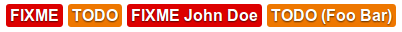

# &lt;fix-me&gt; and &lt;to-do&gt;

Web Components you really want to use.

## Install
```bash
npm i @ondras/fixmetodo --registry https://npm.pkg.github.com
```

## Include
```html
<link rel="stylesheet" href="node_modules/@ondras/fixmetodo/fixmetodo.css" />
<script type="module"   src="node_modules/@ondras/fixmetodo/fixmetodo.js"></script>
```

## Use
```html
<!-- basic usage -->
<fix-me></fix-me>
<to-do></to-do>

<!-- very advanced usage -->
<fix-me who="John Doe"></fix-me>
<to-do who="(Foo Bar)"></to-do>
```

## Result


## Example
https://ondras.github.io/fixmetodo/


## Awesome!
Built with love (and caribbean rum) by [Ondřej Žára](https://ondras.zarovi.cz/)
